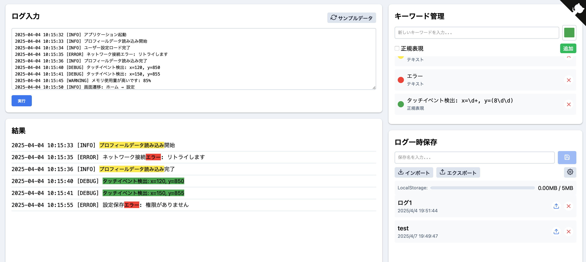

# Android Log Analyzer

Androidアプリのログを解析し、キーワードベースでハイライト表示するシンプルなウェブアプリケーションです。完全にクライアントサイドで動作し、オフラインでも使用できます。

## 機能

- ログテキストの解析とキーワードマッチング
- カスタム色でのハイライト表示
- 正規表現によるパターンマッチング
- ローカルストレージを使用した結果の保存と復元
- 完全にオフラインで動作
- レスポンシブデザイン（モバイル・デスクトップ対応）

## 使い方

1. ログ入力エリアにAndroidアプリのログテキストを貼り付けます
2. キーワード管理セクションからキーワードを追加します
   - 通常のテキスト検索
   - 正規表現によるパターンマッチング
   - カスタム色の選択
3. 「実行」ボタンをクリックして解析を開始します
4. 結果セクションでハイライト表示されたログを確認します
5. 必要に応じて結果に名前をつけて保存します

## 正規表現の例

以下は便利な正規表現の例です：

- `エラー|警告|失敗` - 「エラー」「警告」「失敗」のいずれかを含む行をマッチ
- `タッチイベント検出: x=\d+, y=(\d+)` - タッチイベントの座標を検出
- `0[1-9]|1[0-5]` - 01から15までの2桁数字にマッチ
- `\d{2}:\d{2}:\d{2}` - 時間形式（HH:MM:SS）にマッチ

## インストール

このアプリケーションは単一のHTMLファイルで構成されており、追加のインストールは不要です。

1. リポジトリをクローンするか、ZIPファイルとしてダウンロードします
2. `index.html` をブラウザで開くだけで使用できます

### オンラインデモ

https://yourusername.github.io/android-log-analyzer/

## 貢献方法

1. このリポジトリをフォークします
2. 機能追加やバグ修正のためのブランチを作成します
3. 変更をコミットします
4. プルリクエストを送信します

## ライセンス

[MIT License](LICENSE)
